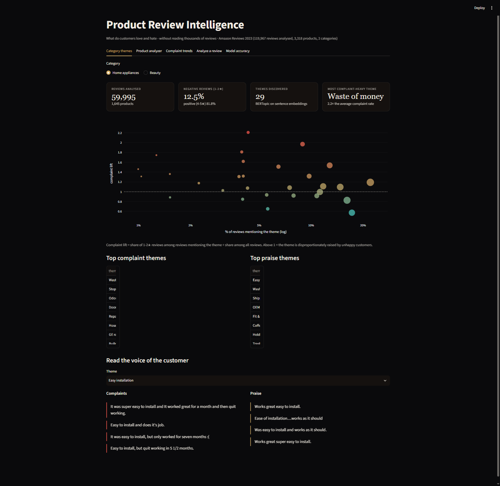
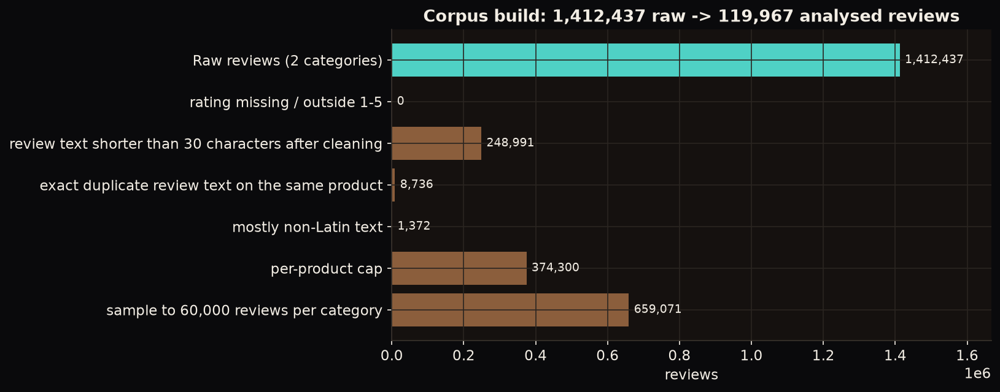
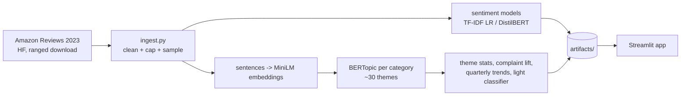
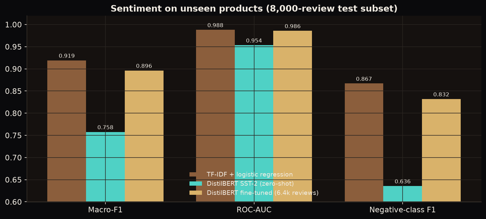
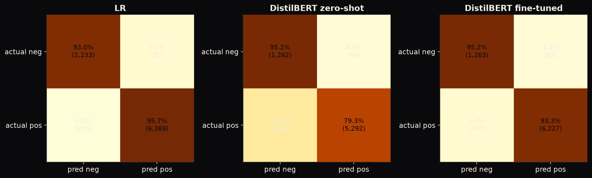
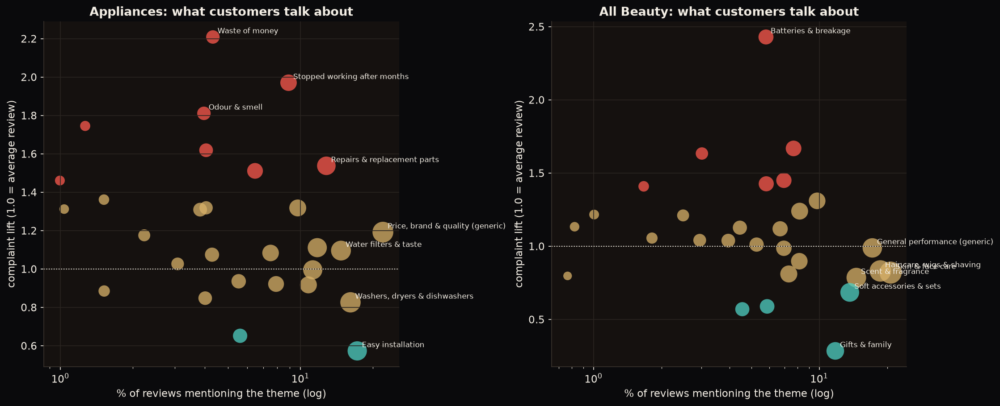
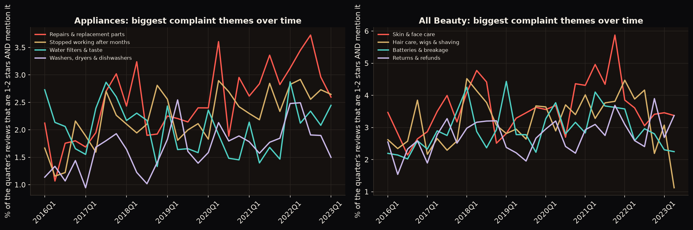
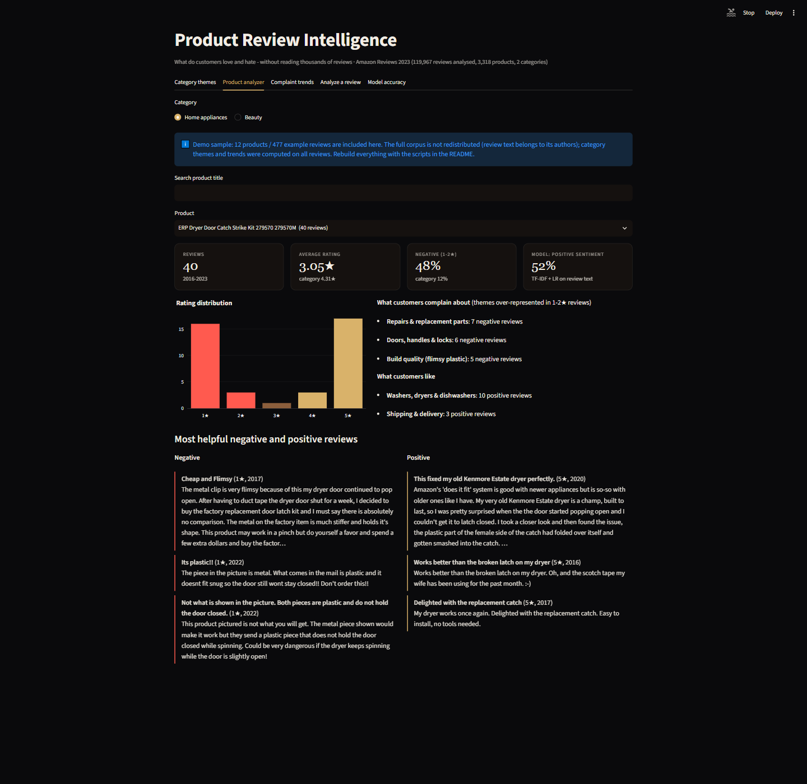
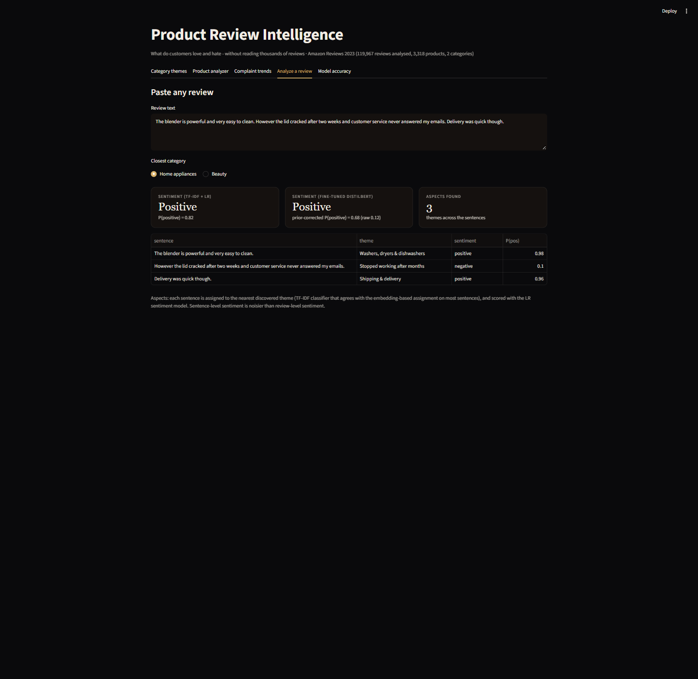

# Product Review Intelligence: Sentiment, Themes & Complaint Trends (NLP)

Turns 120k real Amazon reviews into what a product team actually needs: **how customers feel, which themes they love or hate, how complaints trend, and what a specific product's reviews say**, without reading thousands of reviews. Includes a sentiment benchmark (TF-IDF baseline vs pretrained vs fine-tuned DistilBERT), BERTopic theme discovery on sentence embeddings, and an interactive Streamlit analyzer.

**Live demo:** [https://appuct-review-intelligence-z2ozb4gnvuo8enkunmth3j.streamlit.app/](https://appuct-review-intelligence-z2ozb4gnvuo8enkunmth3j.streamlit.app/) · **Stack:** scikit-learn, Hugging Face Transformers (DistilBERT), sentence-transformers, BERTopic/UMAP/HDBSCAN, MLflow, Streamlit + Plotly



## 1. Business problem

| | |
|---|---|
| **Stakeholder** | Product / category manager (and customer-experience team) |
| **Decisions** | Which product problems to fix first, which strengths to promote, which products are outliers, whether a problem is getting worse |
| **KPIs** | (1) Sentiment quality on **unseen products** (macro-F1, negative-class F1: 82% of reviews are positive, so accuracy is misleading); (2) themes a manager recognises and can act on; (3) a per-product view a person can read in a minute |

## 2. Data

**[McAuley-Lab/Amazon-Reviews-2023](https://huggingface.co/datasets/McAuley-Lab/Amazon-Reviews-2023)** on Hugging Face (Hou et al., 2024; public, no login). Categories: **Appliances** and **All_Beauty**, plus the product metadata files for titles. The review files are huge, so Appliances is read up to a 320 MB budget (parallel ranged download) and All_Beauty in full: **1,412,437 raw reviews**.

Corpus build (`src/reviewintel/ingest.py`, `artifacts/cleaning_report.json`):

| Step | Reviews removed |
|---|---|
| Rating missing / outside 1-5 | 0 |
| Text < 30 characters after cleaning ("Good", "Love it") | 248,991 |
| Exact duplicate text on the same product | 8,736 |
| Mostly non-Latin text (not English) | 1,372 |
| Cap of 40 reviews per product (stops blockbusters dominating) | 374,300 |
| Sample to 60k per category, **keeping whole review sets of products with ≥ 25 reviews first** | 659,071 |
| **Analysed corpus** | **119,967 reviews · 3,318 products · 2002-2023** (dense 2016-2022) |

Real-data quirks handled: HTML tags and URLs stripped; **encoding damage in the source** (`it�s` → `it's`) repaired; the "All_Beauty" category also contains items that are not beauty products (e.g. printer ink), so themes come from the text, not the category label. Ratings are J-shaped: 65% 5★, 11.6% 1★, 7% 3★ (Beauty has 20.7% negative reviews, Appliances 12.5%).



**What is (and is not) in this repository.** The full 120k-review corpus is **not** redistributed: review text belongs to its authors. The repo ships only (a) **477 example reviews from 12 products** (`artifacts/reviews_sample.parquet`) so the demo's product analyzer works, (b) ~700 short sentence excerpts used as theme examples, and (c) aggregate statistics computed on the full corpus (no text). Attribution: `artifacts/DATA_ATTRIBUTION.txt`: *Hou, Y., Li, J., He, Z., Yan, A., Chen, X., McAuley, J. (2024). Bridging Language and Items for Retrieval and Recommendation. arXiv:2403.03952; data from [McAuley-Lab/Amazon-Reviews-2023](https://huggingface.co/datasets/McAuley-Lab/Amazon-Reviews-2023).* Rebuild the full corpus from the original source with `python -m reviewintel.ingest`.

## 3. Architecture



## 4. Sentiment: approach and results

**Task:** positive (4-5★) vs negative (1-2★); 3★ excluded (ambiguous). **Split by product** (70/10/20) so the test set contains only products no model has seen. All models are evaluated on the same fixed **8,000-review test subset**.

| Model | Train data | Accuracy | **Macro-F1** | ROC-AUC | Negative F1 | Brier |
|---|---|---|---|---|---|---|
| **TF-IDF + logistic regression (deployed)** | 77,869 | 0.953 | **0.919** | 0.988 | 0.867 | 0.036 |
| DistilBERT SST-2, zero-shot | 0 | 0.819 | 0.758 | 0.954 | 0.636 | 0.163 |
| DistilBERT fine-tuned (1 epoch, CPU) | 6,400 (balanced) | 0.936 | 0.896 | 0.986 | 0.832 | 0.051 |



**What the comparison really says** (I also ran the controls that keep it fair):

* The zero-shot movie-review model is a poor fit for product reviews (negative precision 0.48).
* The simple **LR wins at the default threshold, but it saw ~12× more labelled data**. Trained on the *same* 6,400 reviews, LR scores macro-F1 **0.872** (AUC 0.980) vs **0.896** (AUC 0.986) for the fine-tuned transformer: the transformer is more data-efficient. LR on 20k reviews: 0.904; on all 78k: 0.919.
* **Prior shift:** balanced fine-tuning makes the transformer over-predict negatives on the natural 82/18 population. A decision threshold chosen on a validation subset (0.06) lifts its macro-F1 from 0.896 to **0.920**, matching the LR (full-test LR with a validated threshold of 0.40: 0.926 macro-F1).
* **Decision:** the deployed model is the LR: tiny (2 MB), thousands of reviews/s, best calibrated, no torch needed. The fine-tuned DistilBERT is an optional second opinion (the app loads it if torch and `models/distilbert_finetuned` are present; zero-shot inference speed is ~19 reviews/s on a laptop CPU).
* **Robustness:** LR trained on ≤ 2020 and tested on 2021+ keeps macro-F1 at 0.918: no visible temporal decay.



**Error analysis** (`notebooks/02_sentiment_models.ipynb`):
* Errors concentrate on the **borderline stars**: LR error rate is 13% on 2★ and 13% on 4★ vs 4% on 1★ and 3% on 5★: mixed reviews ("works well but the rose fragrance is too strong").
* **Label noise** shows up in the shared errors (a 1★ review titled "Gentle effective facial cleanser"; 2★ texts that are mildly positive).
* Long reviews (> 500 characters) are hardest (LR macro-F1 0.858 vs 0.942 for < 80 characters): the verdict is buried in a narrative and the transformer truncates at 96-128 tokens.
* Appliances is harder than Beauty for every model (LR 0.905 vs 0.928).
* 137 test reviews are misclassified by both LR and the fine-tuned model; 241 only by LR and 219 only by the transformer: the models make different mistakes, so an ensemble would help (not built).

## 5. Theme discovery (aspects)

**Method** (`themes.py`, `run_themes.py`): reviews → **320,670 sentences** → `all-MiniLM-L6-v2` embeddings → per category **BERTopic** (UMAP → HDBSCAN → c-TF-IDF) fitted on a 30k-sentence sample that deliberately over-samples sentences from ≤ 3★ reviews, merged to ~30 themes → every other sentence assigned to the nearest theme centroid → statistics per theme:

* **complaint lift** = P(1-2★ | theme mentioned) ÷ P(1-2★). A *correlation* with unhappy reviews, not proof of cause;
* share of reviews, average rating, representative complaint / praise sentences, quarterly complaint share (2016-2023);
* a light TF-IDF theme classifier so the deployed app can tag the sentences of any pasted review without torch (agrees with the embedding assignment on ~76% of held-out sentences).

Theme *names* are written by me from the top words and example sentences (`artifacts/theme_names.json`, raw top-words kept alongside); catch-all themes ("Price, brand & quality", star-rating chatter) are flagged "generic" and excluded from complaint/strength lists.



**Top themes by complaint lift** (themes mentioned by > 1.5% of reviews)

| Category | Complaint themes | Praise themes |
|---|---|---|
| Appliances | Waste of money 2.21× · **Stopped working after months 1.97× (8.9% of reviews)** · Odour & smell 1.81× · Doors, handles & locks 1.62× | Easy installation 0.57× (4.51★) · Washers/dryers · Shipping & delivery |
| Beauty | **Batteries & breakage 2.43× (avg 2.75★)** · Returns & refunds 1.67× · Not as pictured / described 1.63× · Unmet expectations 1.45× | **Gifts & family 0.28× (4.61★)** · Cases & travel bags · Ease of use & instructions |

**Complaint trends** (`06_complaint_trends.png`): quarterly shares are noisy in a sampled corpus (a few hundred to a few thousand reviews per quarter); *repairs & replacement parts* and *stopped working* complaints creep up in Appliances after 2020. Read direction, not exact percentages.



## 6. The app

| Tab | What it does |
|---|---|
| Category themes | Theme map (share vs complaint lift), top complaint / praise themes, example complaint and praise sentences per theme |
| **Product analyzer** | Pick a product (12 sample products in the public demo; all 3,318 locally with `REVIEWINTEL_FULL=1`): rating distribution, model-predicted sentiment, recurring complaint and praise themes, most helpful negative / positive reviews |
| Complaint trends | Quarterly complaint share for selected themes |
| **Analyze a review** | Paste any review → sentiment (LR, plus fine-tuned DistilBERT if available) and a sentence-by-sentence aspect table (theme + sentiment) |
| Model accuracy | Benchmark table and the corpus-cleaning waterfall |



For the pasted review *"The blender is powerful and very easy to clean. However the lid cracked after two weeks and customer service never answered my emails. Delivery was quick though."* both models call the review overall **positive** (LR 0.82; fine-tuned DistilBERT prior-corrected 0.68), but the aspect table isolates the negative part: the sentence about the cracked lid is assigned to a durability theme and scored **negative (0.10)** while the cleaning and delivery sentences are positive. This is the kind of mixed review both models find hardest.



## 7. Limitations & honest caveats

* **Sentiment labels come from star ratings**, which are noisy (some 1★ reviews are positive text). Reported scores measure agreement with the star rating, not with human judgement.
* **The transformer was fine-tuned on only 6,400 reviews for one epoch** because everything runs on a laptop CPU (~25 min). A larger fine-tune would likely beat the LR; I did not test that.
* **Themes are approximate.** Sentence-level assignment is a nearest-centroid rule; the light classifier used in the app agrees with it on ~76% of held-out sentences, and a sentence can belong to several themes. Names are my interpretation.
* **Complaint lift is correlational.** The corpus is a sample (whole-product review sets for products with ≥ 25 reviews), so it over-represents popular products, and quarterly trend lines are noisy.
* The public demo shows only a 12-product sample in the product analyzer (category themes, trends and accuracy tables were computed on the full corpus).
* Two categories only; English only (mostly non-Latin text was filtered out); the source's category labels contain non-beauty items.
* The fine-tuned model (255 MB) is **not in git**: it lives on the Hugging Face Hub (see section 9) and the app downloads it at start-up. Without torch or the Hub model the app still works with the LR alone.

## 8. Repository layout

```
src/reviewintel/  config, ingest, sentiment, train_sentiment, themes, run_themes, hub, viz, report
app/              Streamlit app (light: scikit-learn only; optional DistilBERT panel)
notebooks/        01_corpus_themes.ipynb, 02_sentiment_models.ipynb (executed)
tests/            10 tests: text cleaning, corpus waterfall, product-disjoint splits, LR learning, metrics, sentence splitting, theme lift
artifacts/        committed outputs the app reads (~40 MB): 477-review attributed sample, themes, trends, LR + theme classifiers, metrics
reports/figures/  charts used here and on the portfolio
.github/workflows/ci.yml   ruff + pytest on every push
Dockerfile        container for the light app
```

## 9. How to run

```bash
uv sync --all-groups && uv pip install -e .
uv run python -m reviewintel.ingest            # parallel download (~1.1 GB) + cleaning (~5 min)
uv run python -m reviewintel.train_sentiment   # LR + DistilBERT zero-shot + fine-tune (~45 min on a laptop CPU)
uv run python -m reviewintel.train_sentiment extra   # LR learning curve (equal-data comparison)
uv run python -m reviewintel.run_themes        # embeddings (~30 min) + BERTopic + statistics
uv run python -m reviewintel.report            # figures
uv run pytest -q && uv run ruff check .
uv run streamlit run app/streamlit_app.py
```

**Model on the Hugging Face Hub.** After `hf auth login`, `python -m reviewintel.hub publish` uploads the fine-tuned model with a model card and writes `artifacts/hf_model.json`; the app then loads it from the Hub (`REVIEWINTEL_HF_MODEL=<user>/<repo>` overrides it). The app applies the validated decision threshold (0.06) through a prior correction, so the displayed probability is comparable to 0.5.

**Deploy.** *Light* (Streamlit Community Cloud, ~1 GB RAM): main file `app/streamlit_app.py`, dependencies from `requirements.txt`: LR sentiment + themes, no transformer. *Full* (Hugging Face Space, 16 GB): `python -m reviewintel.hub deploy-space` uploads the app, artifacts and `requirements-hf.txt` (torch, transformers), and the Space loads the fine-tuned model from the Hub.

```bash
docker build -t review-intelligence . && docker run -p 8501:8501 review-intelligence   # light image
```

_Data: Amazon Reviews 2023 (Hou et al., 2024), used under the dataset's terms for research. Review texts belong to their authors; user IDs are not used or stored._
